<p align="center">
  
</p>

<h1 align="center">FrontGate</h1>

<p align="center">
  Amazon CloudFront address lists for FortiGate firewalls.<br>
  Reads the official AWS IP ranges and writes FortiOS address objects and a group, ready to paste.
</p>

---

## What it is

AWS publishes every IP range it uses in one file, [ip-ranges.json](https://docs.aws.amazon.com/vpc/latest/userguide/aws-ip-ranges.html), and changes it from time to time. A FortiGate policy cannot use a service name like `CLOUDFRONT`. It needs address objects, and keeping them in sync by hand is slow and easy to get wrong.

`generate.py` closes that gap. It downloads the file, picks the prefixes of the service you ask for (CloudFront by default) and prints FortiOS CLI that creates one address object per prefix plus an address group holding all of them. Use the group in your policies and re-run the script whenever AWS updates its ranges.

It is a single Python file with no dependencies.

<p align="center">
  
</p>

## What you get

- CloudFront by default, or any other service in the AWS file with `--service`
- IPv4 and IPv6 (`address6` objects and an `addrgrp6` group)
- Optional region filter
- Two naming styles: by position (`CLOUDFRONT1`) or by network (`CLOUDFRONT_120.52.22.96_27`)
- Sorted and de-duplicated output, so two runs are easy to compare
- A group that always matches the current ranges exactly, however many times you apply it
- Works offline with a saved copy of `ip-ranges.json`

## Quick start

You need Python 3.8 or newer. Nothing to install.

```bash
git clone https://github.com/jaba0x/frontgate.git
cd frontgate
python3 generate.py -o cloudfront.conf
```

Open the FortiGate CLI (SSH or the CLI console in the web interface), paste the contents of `cloudfront.conf`, then use the address group `CLOUDFRONT` as a source or destination in your policies.

The configuration goes to stdout, or to the file given with `-o`. A one line summary goes to stderr, so it never ends up in your config:

```
frontgate: 3 IPv4 prefixes for CLOUDFRONT (AWS syncToken 1700000000, published 2026-10-01-00-00-00)
```

Shortened example of the output:

```
config firewall address
    edit "CLOUDFRONT1"
        set subnet 13.32.0.0 255.254.0.0
    next
    edit "CLOUDFRONT2"
        set subnet 120.52.22.96 255.255.255.224
    next
    edit "CLOUDFRONT3"
        set subnet 205.251.249.0 255.255.255.0
    next
end
config firewall addrgrp
    edit "CLOUDFRONT"
        set member "CLOUDFRONT1"
        append member "CLOUDFRONT2"
        append member "CLOUDFRONT3"
    next
end
```

The group starts with `set member`, which replaces whatever was in it, and then adds the rest with `append member`. That is what keeps the group identical to the current list on every run.

### Keeping it current

Run the script on a schedule and apply the result when it changes:

```bash
0 3 * * *  cd /opt/frontgate && python3 generate.py -o cloudfront.conf
```

FrontGate only writes the configuration. Applying it to the firewall is up to you.

## Options

| Option | Default | Description |
|---|---|---|
| `-s`, `--service` | `CLOUDFRONT` | Service to read from `ip-ranges.json`, for example `CLOUDFRONT_ORIGIN_FACING` |
| `-r`, `--region` | all | Only include prefixes of this AWS region, for example `GLOBAL` |
| `-f`, `--family` | `4` | IP version to generate: `4`, `6` or `both` |
| `-p`, `--prefix` | service name | Name prefix of the address objects |
| `-g`, `--group` | the prefix | Name of the address group |
| `-n`, `--naming` | `index` | `index` gives `CLOUDFRONT1`, `prefix` gives `CLOUDFRONT_120.52.22.96_27` |
| `-i`, `--input` | download | Read a local `ip-ranges.json` instead of downloading it |
| `-o`, `--output` | stdout | Write the configuration to a file |
| `--list-services` | | Print the services in the file and exit |

Not sure which service names exist? Ask the file:

```bash
python3 generate.py --list-services
```

### Object names

With `--naming index` objects are numbered in sorted order, and the group has the name you gave with `-g`. IPv6 objects get a `_V6` marker so they never clash with IPv4 names:

| | IPv4 | IPv6 |
|---|---|---|
| Objects, `index` | `CLOUDFRONT1` | `CLOUDFRONT_V6_1` |
| Objects, `prefix` | `CLOUDFRONT_120.52.22.96_27` | `CLOUDFRONT_V6_2600-9000--_28` |
| Group | `CLOUDFRONT` | `CLOUDFRONT_V6` |

## Good to know

- **Review before you paste.** The script only prints text. Read it, and test on a non production firewall if you can.
- **Check your limits.** FortiGate models and FortiOS versions limit how many address objects and group members you can have. CloudFront has a long list, so look up the numbers for your model before importing.
- **Old objects stay.** When AWS drops a range, the group no longer contains it, but its address object stays on the firewall until you delete it.
- **Index names can move.** With `--naming index` the numbers follow the sorted list, so `CLOUDFRONT7` can point at a different range after AWS changes the file. If anything else on the firewall refers to individual objects, use `--naming prefix`, where a name always means the same network.
- **Upgrading from the first version.** Early versions of this script wrote `select member` for every address, which replaces the group each time and leaves only the last address in it. The current output fixes that and uses the full `set subnet <address> <mask>` form. Generate the configuration again and apply it over the old one.

## Author

Jaba Macharashvili, [jaba.ge](https://jaba.ge)

This project is not affiliated with or endorsed by Amazon Web Services or Fortinet. Amazon CloudFront, AWS, Fortinet and FortiGate are trademarks of their owners.
